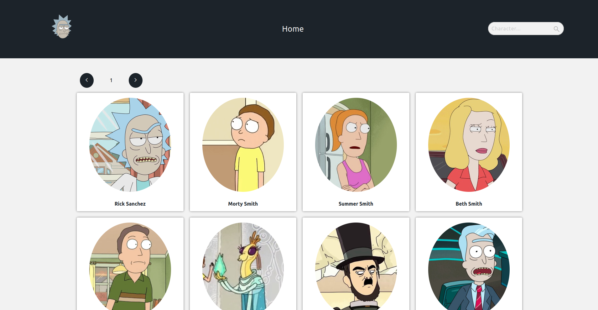
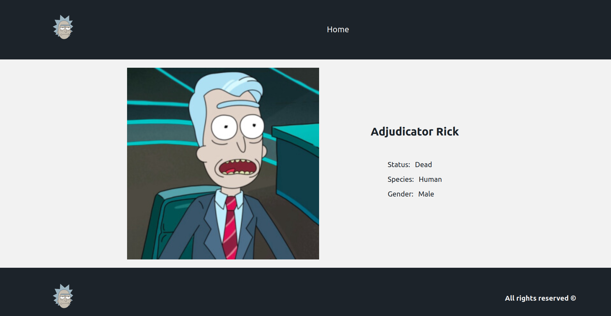

# Rick & Morty API

El proyecto consta en consumir la api de Rick and Morty de la cual se visualizan los diversos personajes de la serie, tambien se puede buscar por el nombre de alguno de ellos y al ingresar en un personaje se visualizara mas informacion de este.

Para el desarrollo de este se empleo React y Redux para el manejo de estados; En el css se implemento Sass.

## Home 

## Detail
